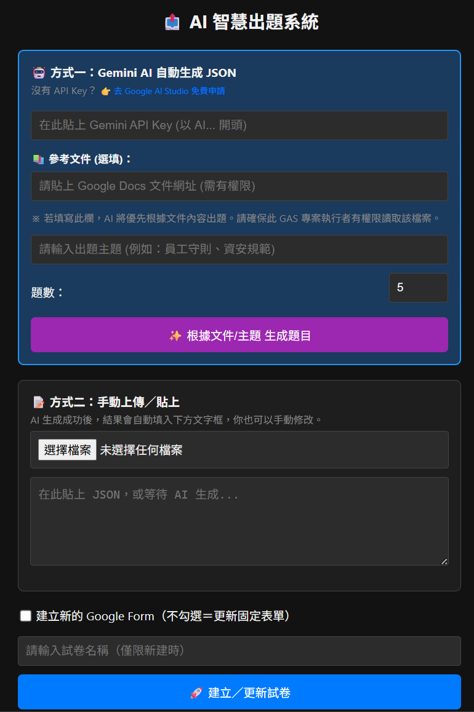

# 🎓 AI 智慧出題系統 (Google Apps Script + Gemini API)

這是一個基於 Google Apps Script (GAS) 開發的自動化出題系統。它整合了 **Google Gemini AI (gemini-2.5-flash)** 模型，能夠根據使用者提供的 **「主題關鍵字」** 或 **「Google Docs 文件連結」**，自動生成專業的單選題，並一鍵轉換為 Google Form 測驗卷。

系統同時綁定 Google Sheet 後台，具備自動閱卷、錯題記錄與成績統計功能，適合企業培訓、學校考試或個人學習使用。



## ✨ 主要功能

* **🤖 AI 智慧出題**：串接 Google Gemini API，支援自訂題數與難度主題。
* **📚 RAG 文件閱讀 (Retrieval-Augmented Generation)**：
    * 支援讀取 **Google Docs** 內容。
    * 強制 AI 「完全依據文件內容」出題，避免 AI 產生幻覺或瞎掰外部知識。
* **📝 自動建立表單**：
    * 一鍵將生成的 JSON 題目轉換為 Google Form。
    * 自動設定為「測驗模式」、配置正確答案與詳解回饋。
* **📊 自動閱卷與統計**：
    * 內建 `onFormSubmit` 觸發器。
    * 學生交卷後，系統自動比對答案，將「成績」、「錯題詳解」與「答題統計」即時寫入 Google Sheet。
* **🔄 雙模式運作**：
    * **新建模式**：每次產生一份全新的 Google Form。
    * **更新模式**：更新同一份固定表單 (適合做為長期固定的測驗入口)。

---

## 🚀 安裝與部署教學

本系統必須綁定在 Google Sheets 上運作 (Container-bound Script)，請務必依照以下順序操作。

### 步驟 1：建立後台管理試算表
本系統需要特定的試算表結構 (包含錯題紀錄、觸發器管理等分頁) 才能運作。
請點擊下方連結，直接建立我們準備好的範本副本：

👉 **[點擊此處建立系統副本 (Google Sheet Template)](https://docs.google.com/spreadsheets/d/1mdztEF1ZNfqmp7fkdzIZ64gQnsfXLNTt626I3L4htPk/copy)**

> **注意**：建立副本後，這份試算表就是您的「後台管理中心」，未來所有的考卷連結、分數與錯題紀錄都會自動匯入這裡。

### 步驟 2：開啟 Apps Script 編輯器
1.  在您剛剛建立的試算表副本中，點擊上方選單的 **「擴充功能 (Extensions)」**。
2.  選擇 **「Apps Script」**。
3.  這會打開一個綁定該試算表的專案編輯器。

### 步驟 3：部署程式碼
請將 GitHub 專案中的檔案內容複製到編輯器中對應的檔案：

1.  **後端邏輯**：清空編輯器中的 `Code.gs`，將 GitHub 的 `Code.js` 內容完整複製貼上。
2.  **前端介面**：新增一個 HTML 檔案命名為 `index.html`，將 GitHub 的 `index.html` 內容複製貼上。
3.  **專案設定**：
    * 點擊左側「專案設定 (Project Settings) ⚙️」。
    * 勾選「在編輯器中顯示「appsscript.json」資訊清單檔案」。
    * 回到編輯器，點開 `appsscript.json`，將 GitHub 的 `appsscript.json` 內容完整覆蓋貼上 (確保權限設定正確)。

### 步驟 4：專案參數設定 (重要！)
若您希望使用 **「更新固定表單」** 的功能 (將題目更新到同一份考卷，而非每次產生新的)，請依照以下步驟設定：

1.  自行建立一個新的 Google Form (這將是您的固定考卷)。
2.  從瀏覽器網址列複製該表單的 ID (網址 `.../d/` 與 `/edit` 之間的那串亂碼)。
3.  回到 GAS 編輯器的 `Code.gs`。
4.  找到最上方的 `CONFIG` 區塊，修改 `FIXED_FORM_ID`：
    ```javascript
    const CONFIG = {
      TRIGGER_SHEET_NAME: '觸發器管理',
      FIXED_FORM_ID: '將您的_GOOGLE_FORM_ID_貼在這裡', // <--- 修改這裡
      GEMINI_MODEL: 'gemini-2.5-flash'
    };
    ```
5.  存檔 (Ctrl+S)。

### 步驟 5：取得 API Key
1.  前往 [Google AI Studio](https://aistudio.google.com/)。
2.  登入 Google 帳號，點擊 "Get API key"。
3.  建立並複製您的 API Key (稍後在網頁介面中使用)。

### 步驟 6：首次執行權限核准 (重要！)
為了讓程式能讀取您的雲端硬碟與呼叫外部 API，必須先手動觸發一次授權：

1.  在 `Code.gs` 編輯器上方工具列，選取函式 **`fixPermissions`**。
2.  點擊 **「執行 (Run)」**。
3.  系統會跳出授權視窗，請點擊「審查權限」並選擇您的帳號。
4.  若出現「Google 尚未驗證這個應用程式」，請點擊 **「進階 (Advanced)」** -> **「前往... (Go to ...)」** -> **「允許 (Allow)」**。
    * *此函式會建立暫存檔案以取得 Drive/Docs/Forms 所有權限，執行完畢後會自動顯示「✅ 授權成功」。*

### 步驟 7：部署為 Web App
1.  點擊編輯器右上角 **「部署 (Deploy)」** -> **「新增部署作業 (New deployment)」**。
2.  點擊左側齒輪圖示，選擇 **「網頁應用程式 (Web app)」**。
3.  設定如下：
    * **說明**：AI 出題系統 v1
    * **執行身分 (Execute as)**：**我 (Me)** *(這很重要，代表用您的權限去讀取文件與建立表單)*
    * **存取權 (Who has access)**：**任何人 (Anyone)** 或 **僅限本人** (視您的使用需求而定)。
4.  點擊「部署」，複製產生的 **網頁應用程式網址 (Web App URL)**。

---

## 📖 使用說明

1.  開啟部署好的 **Web App 網址**。
2.  **輸入設定**：
    * 貼上您的 **Gemini API Key**。
    * (選填) 貼上 **Google Docs 文件網址**：若填寫此欄，AI 將會閱讀文件內容並根據內容出題。
    * 輸入 **出題主題** (例如：資安規範、歷史事件)。
    * 設定 **題數**。
3.  點擊 **「✨ 呼叫 Gemini 生成題目」**。
4.  等待 AI 生成 JSON 完畢後，預覽視窗會顯示題目內容。
5.  點擊 **「🚀 建立／更新試卷」**。
6.  完成！系統會回傳 Google Form 的連結，並將紀錄寫入後台試算表。

---

## 📂 專案結構

```text
ai-quiz-generator/
├── Code.js             # 🧠 後端核心邏輯 (處理 API、表單與閱卷)
├── index.html          # 🎨 前端操作介面 (API Key 輸入與 JSON 預覽)
├── appsscript.json     # ⚙️ 專案設定檔 (定義 OAuth 權限範圍)
├── README.md           # 📖 專案說明文件 (安裝教學、功能介紹)
├── LICENSE             # ⚖️ 授權條款 (MIT License)
├── .gitignore          # 🙈 Git 忽略檔 (排除系統垃圾檔)
└── screenshot.png      # 📸 系統介面截圖 (用於 README 展示)

---

## ⚠️ 注意事項與常見問題

1.  **權限問題**：若要使用「參考文件 (Google Docs)」功能，執行 Web App 的帳號 (通常是您自己) 必須擁有該文件的**讀取權限**。
2.  **觸發器限制**：Google 一般帳號限制每個專案最多 20 個觸發器。若您建立了太多份考卷，請定期到後台試算表的「觸發器管理」選單中進行清理。
3.  **API 費用**：目前 Google AI Studio 的 Gemini Flash 模型提供免費額度 (Free Tier)。若用於極高頻率的商業用途，請留意 Google Cloud 的計費標準。
4.  **無法讀取文件？**：請確認您已在 `appsscript.json` 中加入 `https://www.googleapis.com/auth/documents` 權限，並已執行過 `fixPermissions`。

---

## 👨‍💻 作者

**Eason**
一位喜歡用自動化工具解決生活瑣事的資深工程師。

---

## 📜 License

[MIT](LICENSE)